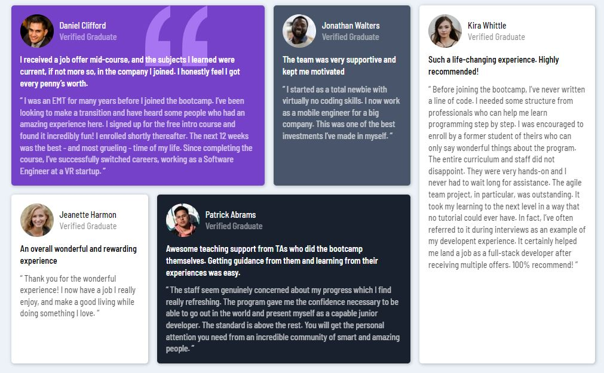

# Frontend Mentor - Testimonials grid section solution

This is a solution to the [Testimonials grid section challenge on Frontend Mentor](https://www.frontendmentor.io/challenges/testimonials-grid-section-Nnw6J7Un7). Frontend Mentor challenges help you improve your coding skills by building realistic projects. 

## Table of contents

- [Overview](#overview)
  - [The challenge](#the-challenge)
  - [Screenshot](#screenshot)
  - [Links](#links)
- [My process](#my-process)
  - [Built with](#built-with)
  - [What I learned](#what-i-learned)
- [Author](#author)
- [Acknowledgments](#acknowledgments)

## Overview

### The challenge

Users should be able to:

- View the optimal layout for the site depending on their device's screen size

### Screenshot

### Links

- Solution URL: [Add solution URL here](https://www.frontendmentor.io/solutions/css-testimonial-grid-section-awVj4KxGNA)
- Live Site URL: [Add live site URL here](https://sakhawat25.github.io/Testimonial-Grid-Section/)

## My process

### Built with

- Semantic HTML5 markup
- CSS custom properties
- Flexbox
- Mobile-first workflow

### What I learned

In this project, I learned the usage of CSS Flex Box, I learned how to make layouts responsive on different screen sizes and I also learned styling text using googlefont's text styles.

## Author

- Frontend Mentor - [@sakhawat25](https://www.frontendmentor.io/profile/sakhawat25)
- Github - [@sakhawat25](https://github.com/sakhawat25/)

## Acknowledgments

I actually watched a video on youtube by "Zach Golwitzer" doing this challange. So I learned some ways from that video to tackle this CSS challange and I am highly thankful of "Zack Golwitzer" for presenting such an informative content.